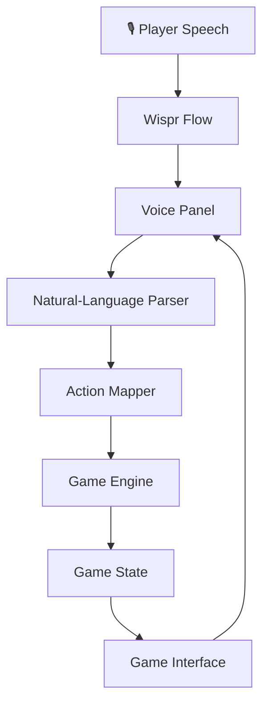

# 🌴 Exploring Goa

### Your summer. Your choices. Your Goa.

**A voice-controlled, three-day adventure game built for Hacker House Goa 2026 and the Wispr Flow task.**

What if you could explore Goa simply by saying what you want to do?

Exploring Goa is a voice-first adventure game where natural-language commands become meaningful gameplay actions. Discover beaches, find affordable food, plan journeys, interact with local characters, complete quests, respond to unexpected events, and make decisions that shape your trip.

Behind its illustrated summer atmosphere is a rule-based natural-language parser, a structured action pipeline, and a game engine that validates decisions and updates the player's state.

**The goal: make voice the way you play, not just the way you control the interface.**

<p align="center">
  <a href="https://vercel.com/shriyapatil1966-6407s-projects/exploring-goa-game/AZBRdS82thXFesygH25xJQfBDMeH">
    
  </a>
  <a href="https://wisprflow.ai/">
    
  </a>
  <a href="https://github.com/ShriyaP1966/ExploringGOA-game">
    
  </a>
</p>

<p align="center">
  <a href="https://react.dev/">
    
  </a>
  <a href="https://www.typescriptlang.org/">
    
  </a>
  <a href="https://vite.dev/">
    
  </a>
  <a href="https://vitest.dev/">
    
  </a>
  <a href="https://oxc.rs/">
    
  </a>
  <a href="LICENSE">
    
  </a>
  
</p>

<p align="center">
  <strong>
    <a href="https://github.com/ShriyaP1966/ExploringGOA-game">Explore the Source Code</a>
    ·
    <a href="#-the-experience">Discover the Game</a>
    ·
    <a href="#-run-locally">Run Locally</a>
    ·
    <a href="LICENSE">MIT License</a>
  </strong>
</p>

---

## 📌 Table of Contents

- [About the Project](#-about-the-project)
- [Hacker House Goa 2026](#-hacker-house-goa-2026--wispr-flow-task)
- [The Experience](#-the-experience)
- [Key Features](#-key-features)
- [How to Play](#-how-to-play)
- [How It Works](#-how-it-works)
- [Tech Stack](#-tech-stack)
- [Run Locally](#-run-locally)
- [Quality Checks](#-quality-checks)
- [Project Demonstration](#-project-demonstration)
- [About the Developer](#-about-the-developer)
- [License](#-license)

## 🌅 About the Project

Exploring Goa reimagines a summer trip as an interactive, voice-controlled adventure.

Rather than navigating a conventional game entirely through menus and buttons, players can express their intentions in natural language. The game interprets supported commands, maps them to possible actions, checks whether those actions are valid, and updates the world accordingly.

Want a beautiful beach that isn't too crowded? Need an affordable way to reach Panjim? Want to go swimming, discover a new location, or check how much money you have left?

Tell the game what you want to do.

The game combines a rule-based language parser with a state-driven engine, resource management, quests, discoveries, inventory, memories, and a personalized adventure recap.

**The central idea is simple: your words initiate actions, and your decisions shape the journey.**

## 🎯 Hacker House Goa 2026 & Wispr Flow Task

Exploring Goa was developed for the **Hacker House Goa 2026 Wispr Flow task**, with a focus on voice-first software creation.

The project explores two complementary uses of voice.

### 1. Voice as a development interface

Wispr Flow is used to dictate natural-language instructions into a coding workflow, helping translate ideas and implementation requirements into software.

### 2. Voice as a gameplay interface

Players can enter natural-language commands into the game interface, including commands dictated using Wispr Flow. The game's own parser interprets supported requests and maps them to gameplay actions.

These are distinct parts of the project: Wispr Flow supports the voice-driven workflow, while the game implements its own rule-based command interpretation and action execution.

The development process involved breaking the application into manageable systems, implementing the game mechanics, checking behavior, and refining the interface while preserving the underlying game logic.

The result is an exploration of how voice-first workflows can help create an interactive application with structured, deterministic gameplay.

## 🎮 The Experience

Your adventure unfolds across **three in-game days in Goa**.

You begin with limited resources and a world to explore. Every decision can affect your journey, from choosing where to travel to deciding how to spend your money, energy, and time.

Discover locations, complete quests, respond to unexpected situations, collect memories, and work towards a final sunset that reflects the adventure you experienced.

### ✨ Key Features

- **🗣️ Natural-language gameplay:** Express intentions using ordinary sentences instead of memorizing rigid commands.
- **🧠 Rule-based language understanding:** Interpret supported commands and identify destinations, activities, budgets, preferences, and constraints without requiring an external LLM API.
- **⚙️ State-driven game engine:** Validate actions against current game conditions before changing the game state.
- **🏖️ Exploration and discovery:** Visit Goa locations and reveal places as the adventure progresses.
- **📅 Three-day progression:** Manage in-game time and make decisions as the trip unfolds.
- **🧭 Quests and objectives:** Follow storylines, work towards goals, and earn rewards.
- **🎲 Dynamic events:** Respond to unexpected situations through choices with meaningful consequences.
- **🎒 Inventory and items:** Collect and use items that contribute to gameplay.
- **💭 Memories and experience:** Record significant moments, earn XP, and progress through levels.
- **💰 Resource management:** Balance money, energy, travel costs, and the time remaining in each day.
- **⭐ Adventure Score:** Complete the trip and receive a recap of your adventure.
- **💾 Persistent progress:** Resume your journey using the game's save functionality.
- **🎨 Illustrated visual design:** Explore a summer-inspired interface featuring Goa-themed scenes, a game HUD, and a personalized ending.

## 🗣️ How to Play

1. Launch the game and select **Start Adventure**.
2. Enter a natural-language command in the panel at the bottom of the screen.
3. Type your command or use Wispr Flow to dictate it.
4. Review what the game understood and the action it proposes or performs.
5. Watch your location, money, energy, time, quests, and discoveries change as you play.
6. Complete your objectives, collect memories, and experience your final sunset.

### Example Voice Commands

| What you say | What you can do |
|---|---|
| "Take me to Vagator." | Request travel to a destination. |
| "What's the cheapest way to Panjim?" | Compare travel options. |
| "Find me cheap food nearby." | Request a suitable food recommendation. |
| "I want a beautiful beach that isn't too crowded." | Find a place based on preferences. |
| "Go swimming." | Request a local activity. |
| "How much money do I have?" | Check your current resources. |
| "Use my tourist map." | Request a discovery hint. |
| "End the day." | Advance the trip to the next day. |
| "Help." | Get suggestions for available commands. |

These are examples of supported command patterns. Actual interpretation depends on the rules implemented in the game.

The parser interprets the sentence, but **the game engine remains responsible for deciding which actions are valid**.

## 🧠 How It Works

Exploring Goa uses a deterministic, rule-based command-processing pipeline rather than sending every player message to an external AI service.



### The Processing Pipeline

**1. Voice input**

Wispr Flow converts spoken commands into text that enters the game's command interface.

**2. Language understanding**

The parser normalizes the input and identifies relevant entities, intent, budget, preferences, and constraints.

**3. Action mapping**

The interpreted command is mapped to a possible game action. Recommendations and confirmation flows can be handled before an action is executed.

**4. Rule enforcement**

The game engine checks whether the requested action is allowed under the current game conditions, including available resources, location discovery, time, and other relevant rules.

**5. State update**

Valid actions update the central game state. The interface reflects the resulting changes, including resource updates, quest progress, discoveries, and memories.

This separation makes the game easier to reason about and test. **The parser interprets intentions; it does not independently mutate the game state.**

## 🛠️ Tech Stack

| Technology | Purpose |
|---|---|
| React | Interactive game interface |
| TypeScript | Typed application logic and game models |
| Vite | Development server and production build |
| Wispr Flow | Voice dictation for development and gameplay |
| Rule-based NLP | Natural-language command interpretation |
| Vitest | Automated testing |
| Oxlint | Code linting |
| Vercel | Deployment |

The application does not require an external LLM API key to interpret gameplay commands.

## 🚀 Run Locally

You can run the project on your own machine.

### Prerequisites

- [Node.js](https://nodejs.org/) 20 or newer
- npm
- [Git](https://git-scm.com/)
- A modern browser

Wispr Flow is optional for launching the application, but is needed for the intended voice-dictation experience.

### 1. Clone the repository

```bash
git clone https://github.com/ShriyaP1966/ExploringGOA-game.git
```

### 2. Enter the project directory

```bash
cd ExploringGOA-game
```

### 3. Install dependencies

```bash
npm ci
```

### 4. Start the development server

```bash
npm run dev
```

Open the local URL printed in the terminal. By default, Vite typically uses:

`http://localhost:5173/`

Keep the terminal running while you play.

## 🧪 Quality Checks

The repository includes scripts for checking and building the application.

Run these commands from the project root:

```bash
npm run typecheck
npm test
npm run lint
npm run build
```

| Command | Purpose |
|---|---|
| `npm run typecheck` | Check TypeScript types. |
| `npm test` | Run the Vitest test suite. |
| `npm run lint` | Check code using Oxlint. |
| `npm run build` | Generate the production build. |
| `npm run preview` | Preview the production build locally. |

## 🎬 Project Demonstration

The project demonstration showcases the voice-first development workflow and the completed game, including its command interface, game systems, and gameplay.

<!-- Replace the placeholder below with your published demonstration video URL. -->

**Demo video:** Coming soon.

## 👩‍💻 About the Developer

**Shriya Patil**  
Third-year B.Sc. Artificial Intelligence student

Exploring Goa combines my interests in artificial intelligence, natural-language processing, interactive software, and voice-first development. The project was an opportunity to bring those ideas together in a playable experience.

- **GitHub:** [@ShriyaP1966](https://github.com/ShriyaP1966)
- **Repository:** [ExploringGOA-game](https://github.com/ShriyaP1966/ExploringGOA-game)

## 📄 License

This project is licensed under the **MIT License**.

You are free to use, copy, modify, merge, publish, distribute, sublicense, and sell copies of the software, subject to the conditions of the license.

The copyright notice and permission notice must be included in copies or substantial portions of the software.

See the [`LICENSE`](LICENSE) file for the complete license text.

---

<p align="center">
  <strong>🌴 Your summer. Your choices. Your Goa.</strong>
  <br/>
  <em>You didn't just visit Goa. You experienced it.</em>
  <br/><br/>
  Built for <strong>Hacker House Goa 2026</strong> using a voice-first development workflow.
  <br/><br/>
  <a href="#-exploring-goa">Back to top ↑</a>
</p>