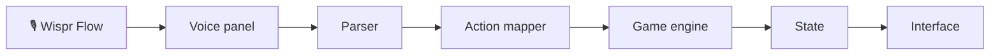

# 🌴 Exploring Goa

**Your summer. Your choices. Your Goa.**

▶️ **Play it live:** https://shriyap1966.github.io/ExploringGOA-game/

A three-day summer trip to Goa that you play by speaking or typing, in your own words.
Explore five places, finish three quests, collect memories, and catch your final sunset for an Adventure Score.

## How to play

1. Press **Start adventure** (or **Continue** to resume; progress saves automatically).
2. Say or type what you want to do in the box at the bottom, then press **Enter**.
3. Watch your money, energy and time in the bar at the top; eat or rest when you run low.
4. Follow the quests and watch your final sunset on Day 3. Say **"help"** any time for ideas.

## Things you can say

| You say | What happens |
|---|---|
| "take me to Vagator" | You travel there |
| "what's the cheapest way to Panjim" | Compares walking, scooter and taxi |
| "find me cheap food nearby" | Suggests a meal; say "yes" to go |
| "go swimming" | Does that activity here |
| "wait for the sunset" | Lets time pass until evening |
| "use my tourist map" | Reveals a hidden place |
| "how much money do I have" | Shows your money, energy and time |
| "end the day" | Goes to sleep until tomorrow |

## Run locally

Requires [Node.js](https://nodejs.org) 20 or newer.

```bash
npm install
npm run dev     # open http://localhost:5173
npm test        # run the tests
```

## Architecture



The parser is rule-based (no AI and no network calls), and only the game engine changes the game state.

Built entirely by voice with Wispr Flow.

Built by Shriya Patil.
