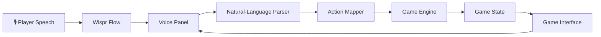

# 🌴 Exploring Goa

### Your summer. Your choices. Your Goa.

<p align="center">
  
  
  
</p>

<p align="center">
  
  
  
  
  
</p>

**Exploring Goa** is a voice-controlled, three-day summer adventure game developed for the **Hacker House Goa Wispr Flow task**.

What if you could explore Goa simply by saying what you want to do?

Instead of navigating a conventional game through menus and buttons, you can express your intentions in natural language. Ask for a beautiful beach, find affordable food, plan a journey, interact with local characters, complete quests, and make decisions that shape your trip.

Underneath its illustrated summer atmosphere is a rule-based natural-language parser, a structured action pipeline, and a game engine that validates decisions and updates the player's state.

The goal is simple: **make voice the way you play, not just the way you control the interface.**

---

## 🎮 The Experience

Your adventure unfolds across three days in Goa. You begin with limited resources and a world to explore. Every decision affects your journey, from choosing where to travel to deciding how to spend your money and energy.

Discover locations, complete quests, respond to unexpected situations, collect memories, and work towards a final sunset that reflects the adventure you experienced.

### ✨ Key Features

- **Natural-language gameplay:** Express intentions using ordinary sentences instead of memorizing rigid commands.
- **Rule-based language understanding:** Extract destinations, activities, budgets, preferences, and constraints without relying on an external LLM or AI API.
- **State-driven game engine:** Actions are validated before the game state changes.
- **Exploration and discovery:** Visit Goa locations and reveal places as your adventure progresses.
- **Three-day progression:** Manage in-game time and make choices around the changing day.
- **Quests and objectives:** Follow connected storylines, work towards goals, and earn rewards.
- **Dynamic events:** Respond to unexpected situations through choices with meaningful consequences.
- **Inventory and items:** Collect and use items that contribute to gameplay.
- **Memories and experience:** Record significant moments, earn XP, and progress through levels.
- **Resource management:** Balance money, energy, travel costs, and the time remaining in each day.
- **Adventure Score:** Reach the end of your trip and receive a recap based on your adventure.
- **Persistent progress:** Resume your journey using the game's save functionality.
- **Illustrated visual design:** Explore a summer-inspired interface featuring Goa-themed scenes, a game HUD, and a personalized ending.

## 🗣️ How to Play

1. Launch the game and select **Start Adventure**.
2. Enter a natural-language command in the panel at the bottom of the screen. You can type a command or use Wispr Flow to dictate it.
3. Review what the game understood and the action it proposes or performs.
4. Watch your location, money, energy, time, quests, and discoveries change as you play.
5. Complete your objectives, collect memories, and experience your final sunset.

### Example Voice Commands

| What you say | What you can do |
|---|---|
| "Take me to Vagator." | Request travel to a destination. |
| "What's the cheapest way to Panjim?" | Compare travel options. |
| "Find me cheap food nearby." | Request a suitable food recommendation. |
| "I want a beautiful beach that isn't too crowded." | Find a place based on preferences. |
| "Go swimming." | Request a local activity. |
| "How much money do I have?" | Check your current resources. |
| "Use my tourist map." | Request a discovery hint. |
| "End the day." | Advance the trip to the next day. |
| "Help." | Get suggestions for available commands. |

The parser interprets the sentence, but the game engine remains responsible for deciding which actions are valid.

## 🧠 How It Works

Exploring Goa uses a deterministic, rule-based command-processing pipeline rather than sending every player message to an external AI service.



### The processing pipeline

**1. Voice input**

Wispr Flow converts spoken commands into text that enters the game's command interface.

**2. Language understanding**

The parser normalizes the input and identifies relevant entities, intent, budget, preferences, and constraints.

**3. Action mapping**

The interpreted command is mapped to a possible game action. Recommendations and confirmation flows can be handled before an action is executed.

**4. Rule enforcement**

The game engine checks whether the requested action is allowed under the current game conditions, including available resources, location discovery, time, and other relevant rules.

**5. State update**

Valid actions update the central game state. The interface reflects the resulting changes, including resource updates, quest progress, discoveries, and memories.

This separation makes the game easier to reason about and test. The parser interprets intentions; it does not independently mutate the game state.

## 🛠️ Tech Stack

| Technology | Purpose |
|---|---|
| React | Interactive game interface |
| TypeScript | Typed application logic and game models |
| Vite | Development server and production build |
| Wispr Flow | Voice dictation for development and gameplay |
| Rule-based NLP | Natural-language command interpretation |
| Vitest | Automated testing |
| Oxlint | Code linting |

The application does not require an external LLM API key to interpret gameplay commands.

## 🚀 Run Locally

You can run the complete project on your own machine.

### Prerequisites

- [Node.js](https://nodejs.org/) 20 or newer
- npm
- Git
- A modern browser

Wispr Flow is optional for launching the application, but is needed for the intended voice-dictation experience.

### 1. Clone the repository

```bash
git clone https://github.com/ShriyaP1966/ExploringGOA-game.git
```

### 2. Enter the project directory

```bash
cd ExploringGOA-game
```

### 3. Install dependencies

```bash
npm ci
```

### 4. Start the development server

```bash
npm run dev
```

Open the local URL printed in the terminal. By default, Vite typically uses:

`http://localhost:5173/`

Keep the terminal running while you play.

## 🧪 Quality Checks

The repository includes scripts for checking and building the application.

Run these commands from the project root:

```bash
npm run typecheck
npm test
npm run lint
npm run build
```

| Command | Purpose |
|---|---|
| `npm run typecheck` | Check TypeScript types. |
| `npm test` | Run the Vitest test suite. |
| `npm run lint` | Check code using Oxlint. |
| `npm run build` | Generate the production build. |
| `npm run preview` | Preview the production build locally. |

## 🎯 About the Hacker House Goa Wispr Flow Task

This project was developed as a response to the **Hacker House Goa Wispr Flow task**, with an emphasis on voice-first software creation.

The project explores two complementary uses of voice:

- **Voice as a development interface:** Wispr Flow is used to dictate natural-language instructions into a coding workflow, enabling the project to be built through spoken instructions.
- **Voice as a gameplay interface:** Players use natural-language commands to interact with the world, request recommendations, make choices, and progress through the adventure.

The development process focused on breaking a complex application into manageable systems, implementing them incrementally, testing their behavior, and refining the interface without losing the underlying game logic.

The result is an exploration of how voice-first workflows can be used to create an interactive application with structured logic rather than a collection of disconnected screens.

## 👩‍💻 About the Developer

**Shriya Patil**  
Third-year B.Sc. Artificial Intelligence student

Exploring Goa combines my interests in AI, natural-language processing, interactive software, and voice-first development. The project was an opportunity to bring those ideas together in a playable experience.

- GitHub: [@ShriyaP1966](https://github.com/ShriyaP1966)
- Repository: [ExploringGOA-game](https://github.com/ShriyaP1966/ExploringGOA-game)

## 🎬 Project Demonstration

The project demonstration video documents the voice-first development process and showcases the completed game, including its command interface, game systems, and gameplay.

<!-- Add your published demonstration video URL here. -->

## 🌴 The Idea

A trip is more than a list of destinations. It is the choices you make, the unexpected moments, the places you discover, and the memories you bring home.

Exploring Goa turns that idea into a small interactive adventure.

**You didn't just visit Goa. You experienced it.**